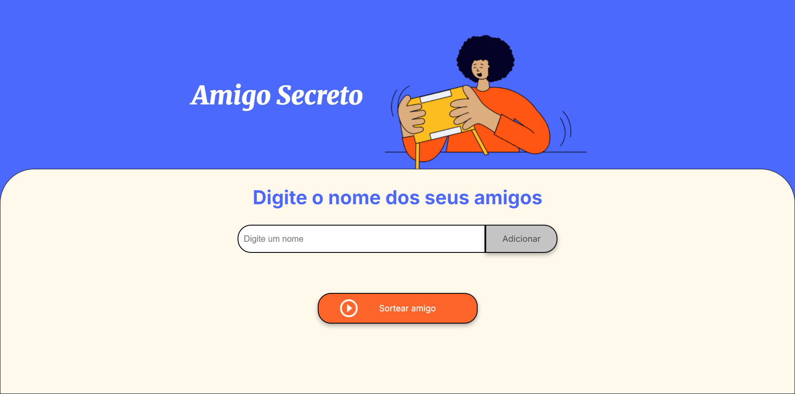
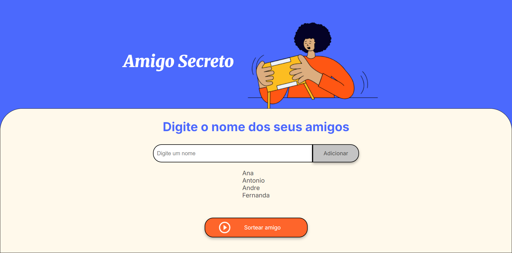
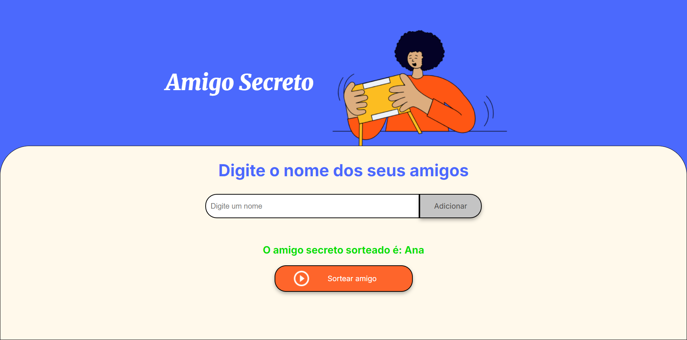

# Amigo Secreto - Sorteador

## 📌 Sobre o Projeto
Este é um projeto simples para sortear um amigo secreto, onde os usuários podem adicionar nomes a uma lista e, em seguida, sortear um nome aleatoriamente.

## 🚀 Funcionalidades
- Adicionar amigos a uma lista.
- Sortear aleatoriamente um amigo secreto.
- Exibir o resultado do sorteio.
- Resetar a lista após o sorteio.

## 🛠️ Tecnologias Utilizadas
- HTML
- CSS
- JavaScript (DOM Manipulation)

## 🎯 Como Usar
1. Insira um nome no campo de entrada.
2. Clique no botão "Adicionar" para incluir o nome na lista.
3. Após adicionar pelo menos dois nomes, clique no botão "Sortear" para selecionar um amigo secreto.
4. O nome sorteado será exibido na tela e a lista será resetada automaticamente.

## 📸 Demonstração

### Home Page

### Adicionar Amigos

### Sortear Amigos

